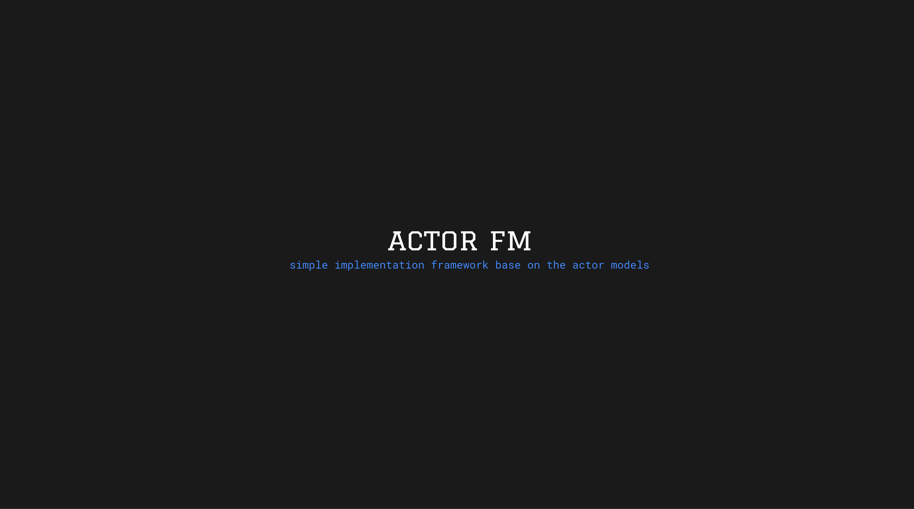

*The actor model is well described and if you don’t know anything about it, you can read about it elsewhere.* 

**This Actor Model behaves as follows:**
- An Actor is a unit of computation. It can accept a message and asynchronously perform some action based on user-specified behaviour.
- Actors have a “sendbox”, usually an in-memory queue that stores messages sent to that actor.
- Actors do not access shared state.
- Actors “own” any state they operate on, so the need for locking mechanisms is reduced*.

**Here’s how it work:**
- Client code define the type of the message an actor can handle, and the type of the result produced by that actor using template parameters. In other words, the actors are statically typed.
- There have a simple actor interface. Clients send a message to an actor in two ways: actor.send if they don’t expect a response, or actor.expect if a response is required.
- Actor systems are instantiated with a thread pool onto which work dispatched.
- Actor systems are instantiated with a scheduler which handle the dispatching of tasks onto the thread pool in a fair manner.
